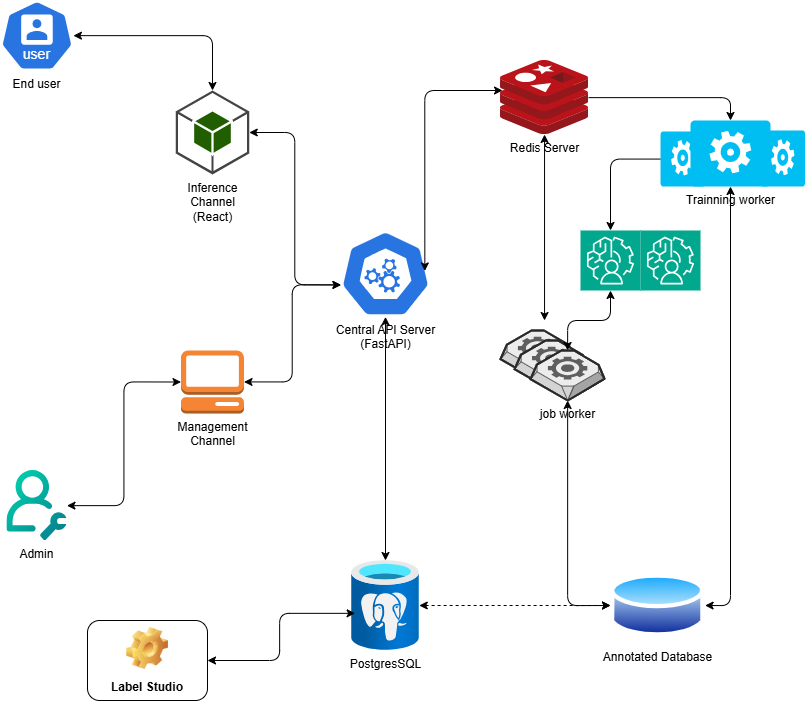

# AI Ecosystem Workspace

## Overview

โปรเจกต์นี้เป็นสถาปัตยกรรมแบบ **Monorepo + Multi-Service** ที่ออกแบบมาเพื่อรองรับระบบ AI Ecosystem ครบวงจร แบ่งการทำงานออกเป็นเซิร์ฟเวอร์หลัก (Central API Server) และระบบประมวลผลเบื้องหลัง (Background Worker Services) ร่วมกับระบบโครงสร้างพื้นฐาน (Infrastructure Services)



## Infrastructure & Components

ระบบประกอบด้วยส่วนประกอบสำคัญดังนี้:

| Component           | Technology   | Description                                                                         |
| ------------------- | ------------ | ----------------------------------------------------------------------------------- |
| **Backend API**     | FastAPI      | Central API Server จัดการ Business Logic, Auth, Storage, Label Studio และ Job Queue |
| **Worker Service**  | ARQ (Python) | Background Worker ดึงงานจาก Redis ไปประมวลผลแบบ Asynchronous                        |
| **Database**        | PostgreSQL   | ระบบฐานข้อมูลเชิงสัมพันธ์หลักสำหรับเก็บข้อมูลผู้ใช้และระบบ                          |
| **In-Memory Store** | Redis        | ใช้สำหรับ ARQ Job Queue และ Cache                                                   |
| **Object Storage**  | MinIO        | S3-Compatible Object Storage สำหรับจัดเก็บไฟล์และข้อมูลมัลติมีเดีย                  |
| **Data Labeling**   | Label Studio | แพลตฟอร์มสำหรับทำ Data Annotation / Labeling                                        |

## Project Structure

```text
AI_workspace/
├── backend/                  # Central FastAPI Application (Layered Architecture)
│   ├── api/                  # Feature Modules (auth, users, storage, label_studio, jobs)
│   ├── core/                 # App Configurations & Settings
│   ├── db/                   # Database Session & Base Models
│   ├── scripts/              # Helper Scripts (e.g. openapi_to_csv.py)
│   └── main.py               # FastAPI Entrypoint
├── service/                  # ARQ Background Worker Service
│   ├── workers/              # Worker task definitions
│   └── main.py               # Worker configuration settings
├── diagrams/                 # Architecture diagrams (overview.drawio, overview.png)
└── compose.yml               # Docker Compose configuration for Infrastructure
```

## Getting Started

### 1. Start Infrastructure Services

เริ่มรันบริการ PostgreSQL, Redis, MinIO และ Label Studio ผ่าน Docker Compose:

```bash
docker compose up -d
```

### 2. Run Backend API Server

ติดตั้ง dependencies และเริ่มรัน FastAPI Central Server:

```bash
cd backend
uv sync
uv run uvicorn main:app --reload
```

### 3. Run Background Worker

เปิดอีกหน้าต่าง terminal เพื่อเริ่มรัน ARQ Background Worker Process:

```bash
# cd service
uv sync
arq service.main.WorkerSettings
```

## Documentation & API References

- **Backend Documentation**: สามารถอ่านรายละเอียดเพิ่มเติมได้ที่ [backend/README.md](backend/README.md)
- **Worker Service Documentation**: สามารถอ่านรายละเอียดเพิ่มเติมได้ที่ [service/README.md](service/README.md)
- **Architecture Diagram**: [diagrams/overview.png](diagrams/overview.png)
